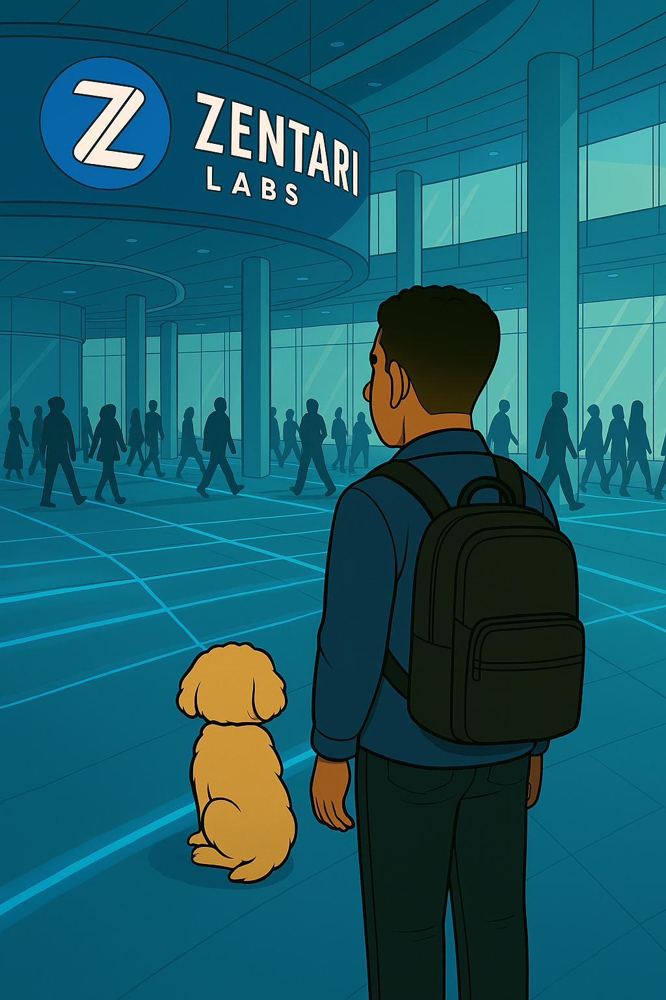
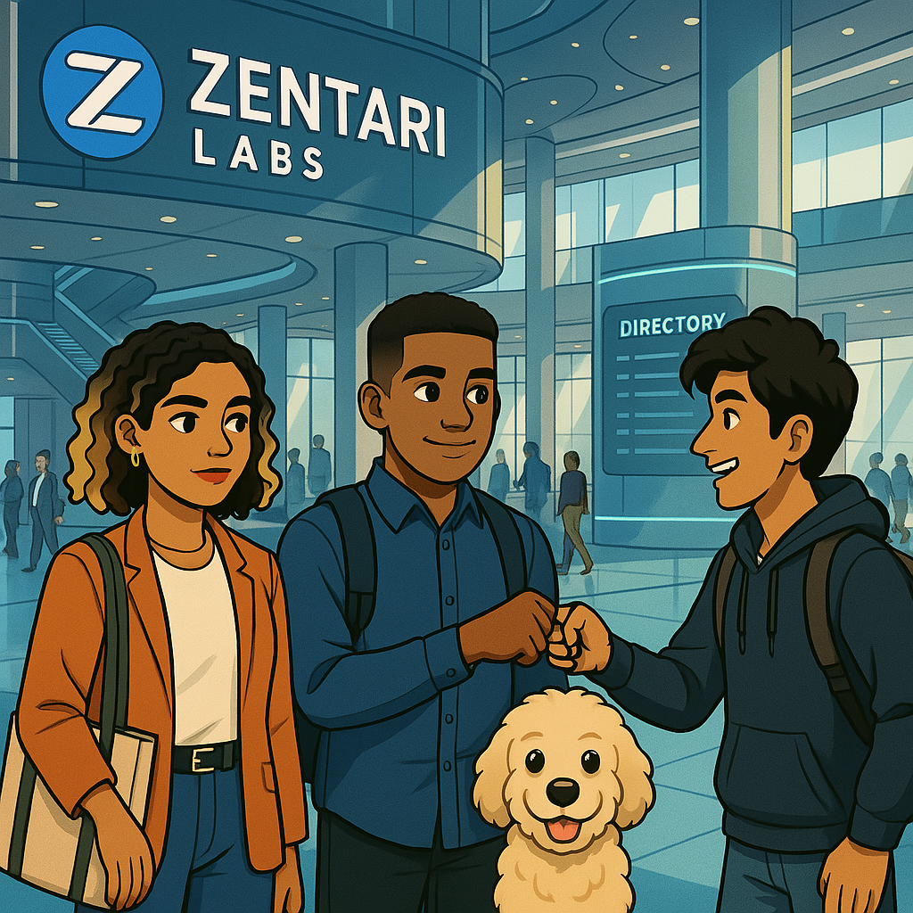
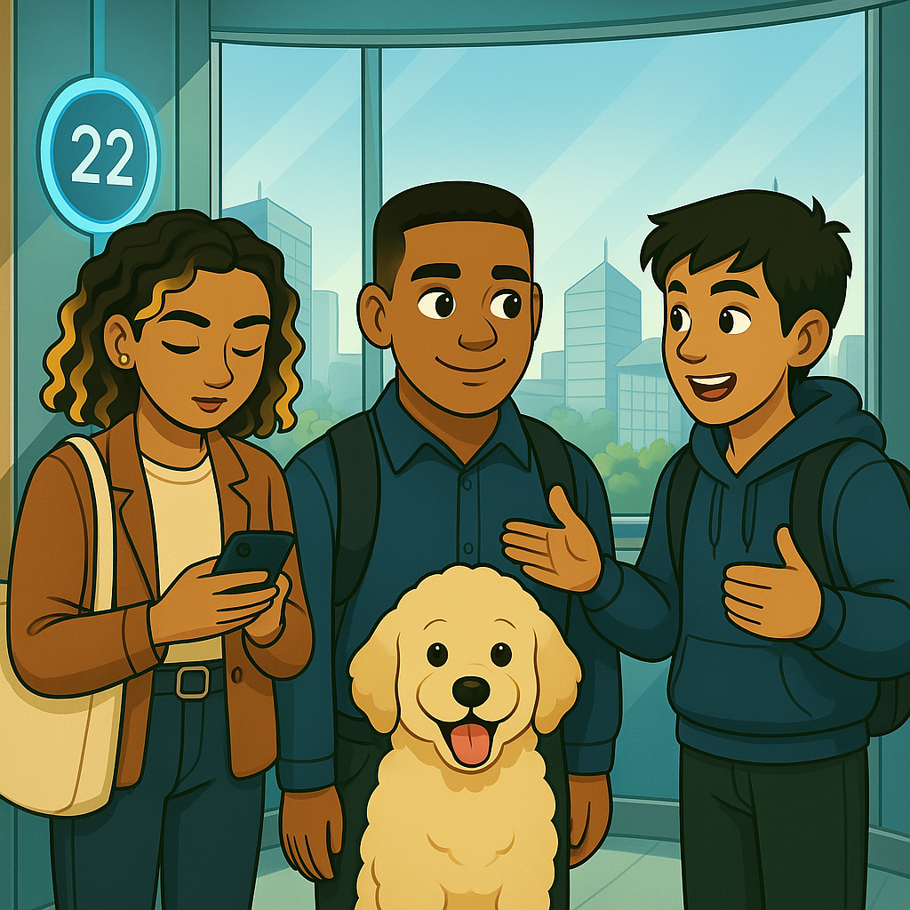
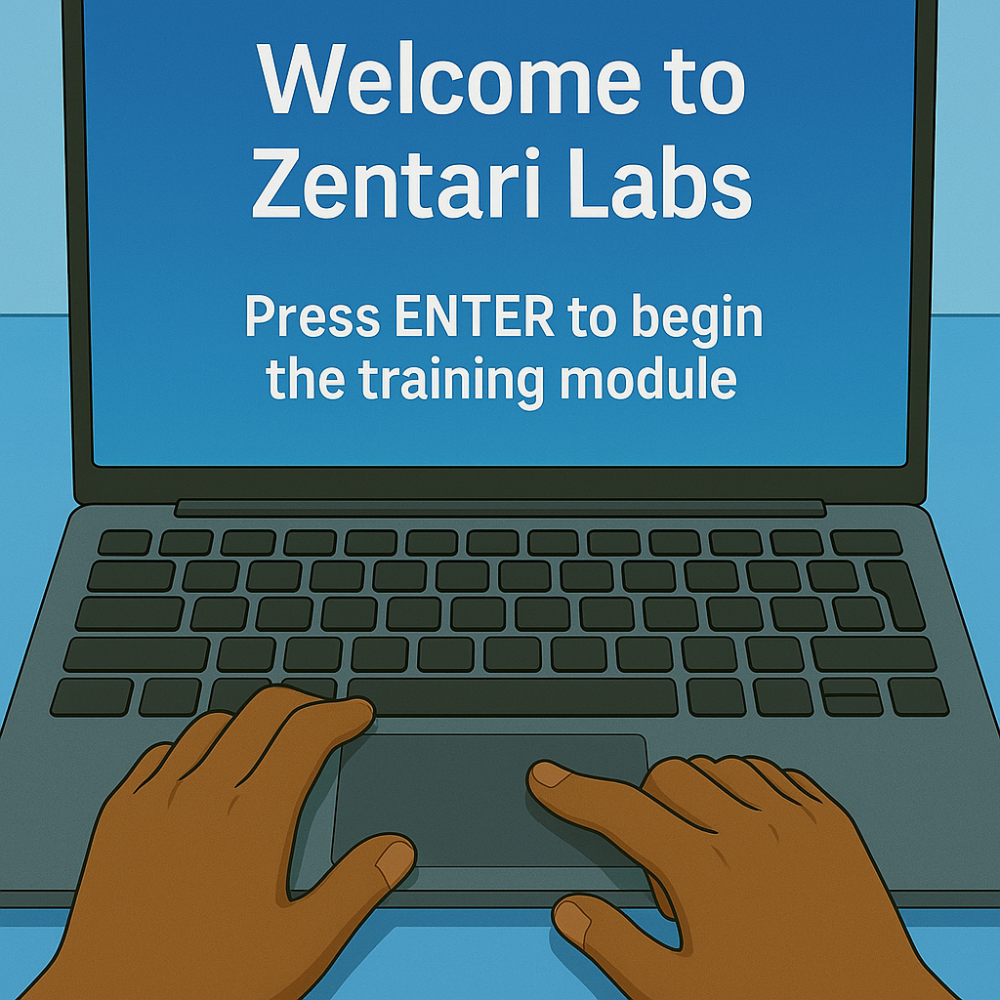

# Case 000: The Curious Ones

---

## Zentari Labs | Lobby | 8:40 AM

---

Renzo stepped into Zentari Labs for the first time, his eyes wide as he scanned the chrome and glass lobby bathed in soft blue light. Next to him, Inspector Pupps sat alert but calm, his golden curls catching the morning light from the floor to ceiling windows.

Every surface whispered, "You don’t belong here unless you’re brilliant."

Renzo adjusted the strap on his bookbag, nerves prickling beneath his skin. He glanced down at Pupps, who gave a soft, grounding huff.

The sharp tap of sneakers on polished tile drew his attention behind him.

Zara stepped into the lobby. Her curls bounced slightly with each stride, blonde highlights catching the light. She was effortlessly styled with a blazer, jeans, sneakers, gold accessories, and carried a tote over her shoulder. She gave Renzo a subtle nod. Not unfriendly, just… focused.

He thought. "Say something. Anything. You’re both interns. She probably feels weird too."

Before the silence settled too heavily, the lobby doors opened again.

Dev stepped in, hoodie layered over a collared shirt, slacks slightly wrinkled, and a bag packed like he was staying the night. His eyes lit up at the sight of the others.

"Yo! Project Nova? Right?" Dev said, offering a fist bump to Renzo. Renzo returned it, a bit stiffly.

Zara gave him a polite, distant nod, then glanced at the shared email. "Floor 22" she said. "That’s where we’re headed."

After checking in, they followed a glowing line on the floor marked “Elevators.” The hallway curved ahead, all glass and polished steel, reflecting more light than felt natural. Renzo kept pace, his fingers brushing the strap of his backpack. The silence wasn’t threatening, just heavy with expectation. Like the building was holding its breath. Or maybe he was.

---

## Zentari Labs | Elevator | 8:45 AM

---

Zara stepped forward and tapped the number 22. The touchscreen lit up, a glowing blue ring swirling around it as the trio entered and the doors slid shut.

Renzo stood silently, his bag still strapped tightly to his shoulders. Dev swayed slightly, bobbing to a beat in his head. Zara was already scrolling on her phone.

He could feel the difference between them. Dev seemed like the type who made friends in five minutes. Zara looked like she didn’t need anyone at all. Pupps sat between them, calm as ever. His tail brushed Renzo’s ankle in a quiet reassurance.

Dev leaned forward, eyes scanning the glowing panel. "Crazy, right? Out of everyone… why us?" Renzo nodded, but Zara didn’t look up.

The elevator chimed. Floor 22.

---

## Zentari Labs | Floor 22 Training Room | 8:50 AM

---

As the doors slid open, a glowing hallway stretched out, white walls, blue floor lights pulsing gently. A single line of text glowed near the floor:

Only the curious get chosen.

Dev stepped out first, grinning. "I like the vibes already."

The room was a spacious training floor with individual desks, each with a Zentari laptop. Renzo counted eight in total. 

"Are there more of us?" he asked quietly.

Zara didn’t turn. "Eight total. We’re just early."

Renzo slid into the seat farthest from the door. Pupps curled up beside his chair without a sound. Zara took the spot two seats down. Dev sat between them. Four other interns stepped into the room. Some walked directly to their laptops. Others hovered, scanning the space like they weren’t sure where to sit. No one said much. Then came the last: a tall girl with silver glasses with a low side braid. She gave a polite nod to no one in particular and made her way to a desk at the far end.

As the final intern stepped into the room, the lights dimmed. A soft chime echoed overhead. Then, with quiet confidence, a sharply dressed man entered behind them. He moved to the center of the room, raised a hand, and the space responded. A glowing “Z” emblem shimmered into view, slowly rotating before unfolding into a full holographic display.

"Welcome to Zentari Labs" he said, voice calm and reassuring. "You weren’t just chosen for your skills, you were chosen because you’re curious. And in this place, only the curious move forward. You are Cohort 4 of Project Nova. Thousands applied. Only eight were selected"

Dev whispered, "Only the curious get chosen, interesting."

"Project Nova is a fully immersive experience. You’ll receive new cases, and each one reflects a real world challenge you might face in a cloud-native environment. But before each case begins, you’ll complete a brief training module. These are delivered directly to your terminal. Complete the module, and then unlock the case."

Zara leaned back slightly, arms crossed.

"Your first task begins with Kubernetes. You’ll be introduced to the CLI short for command-line interface and kubectl, short for Kubernetes Control. There has been debate on how to pronounce it. But if you want to stand out and be right it’s kyoob-see-tee-ell."

Renzo nodded slightly to himself.

"Training modules will teach you what you need. Cases will show you if you’ve truly learned it."

The hologram folded down like origami into a single blinking prompt.

"Good luck, Cohort 4. Your journey starts now" he added, already walking toward the exit. He didn’t look back, he didn’t need to. The door slid closed behind him with a soft hiss. The room returned to normal light.

Renzo stared at the screen. Next to him, Dev was already typing. Zara was skimming the training module. Pupps had curled up under the desk again, a small safe zone.

Renzo exhaled. He tapped the trackpad. The screen blinked to life.

*Welcome to Zentari Labs*

*Press ENTER to begin the training module...*

He nervously pressed ENTER.

Pupps sat down beside him, calm and watchful. Like he already knew: something was already beginning.

---

### Nova Knowledge Check  
*Pre-Case Readiness Verification*  
To proceed with **Case 001**, all interns must confirm foundational knowledge from the overview.

---
**1. In what Project Nova cohort are you in?**  
A. Cohort 1  
B. Cohort 3 
C. Cohort 4
D. What is a cohort?

Answer
<strong>C — Cohort 4</strong>

---

**2. What does `kubectl` stand for?**  
A. Kubernetes Cluster Tool  
B. Kubernetes Container Loader  
C. Kubernetes Core Terminal
D. Kubernetes Control

Answer
<strong>D — Kubernetes Control</strong>

---

**3. What is the recommended way to pronounce `kubectl`?**  
A. kube cuddle  
B. kube see tee ell 
C. kube control 
D. kubey tool

Answer
<strong>B — kube see tee ell</strong>

To continue your journey:

👉 [**Enter Training Module 001 – What is Kubernetes and Namespaces**](../training-modules/tm-001.md)
