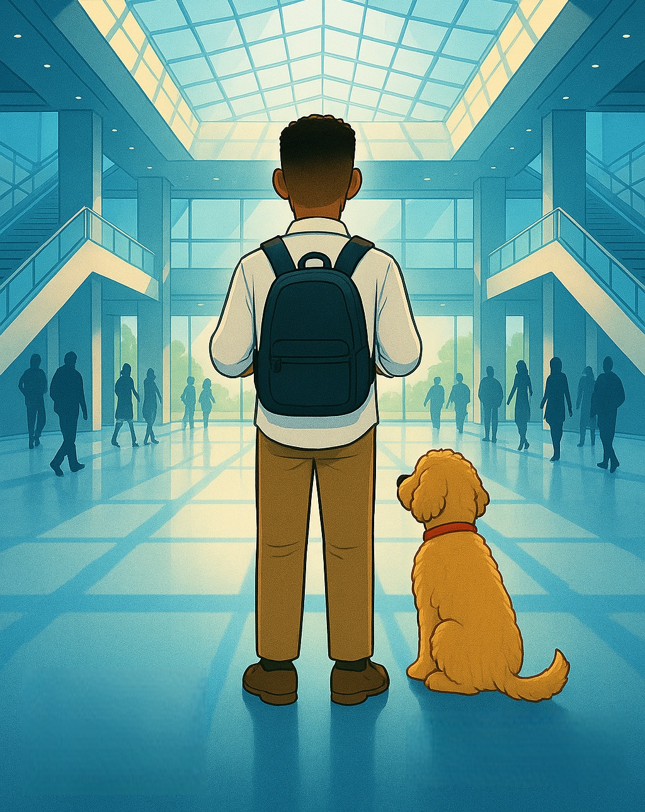
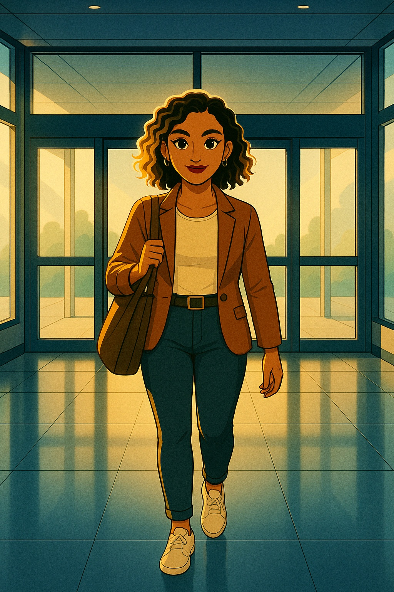
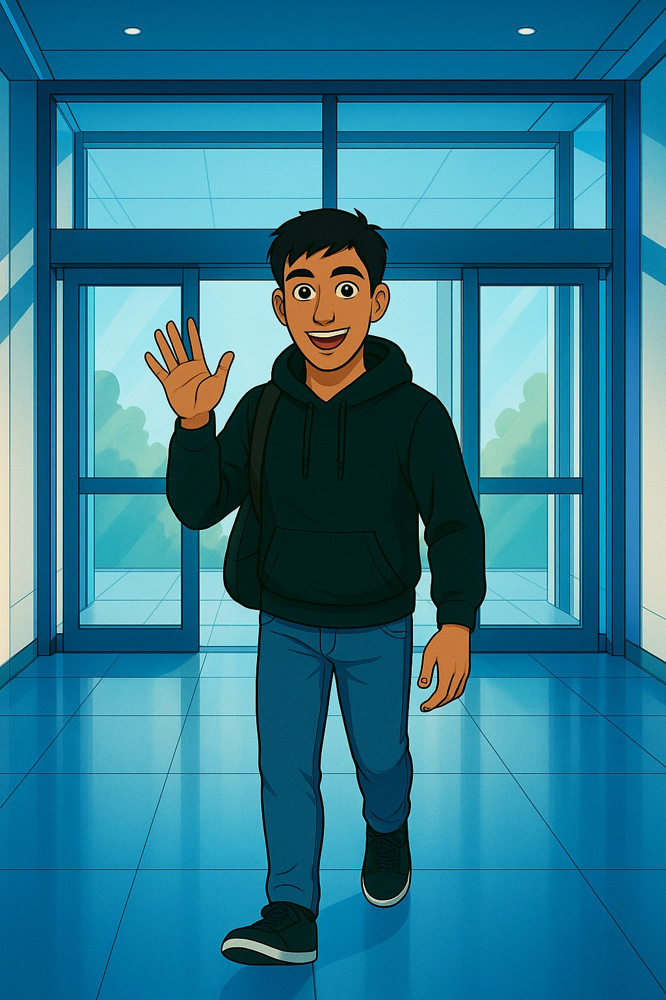
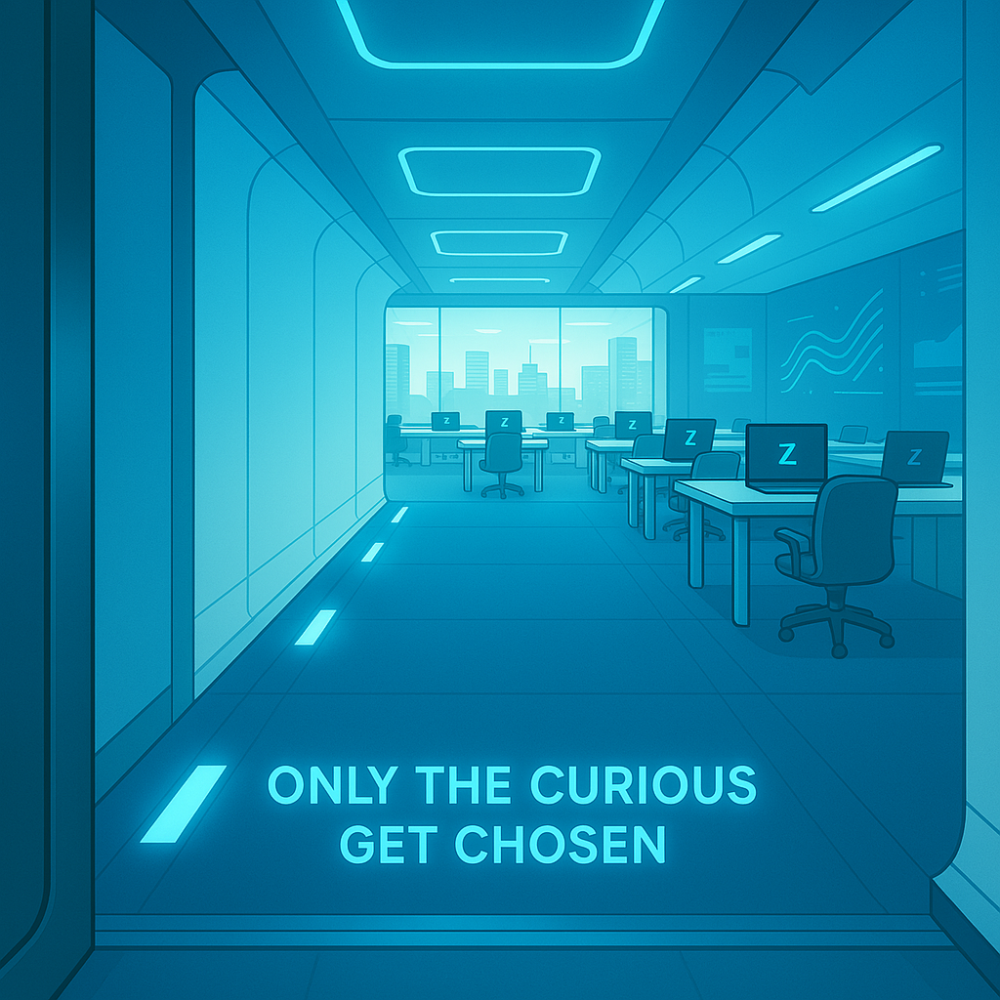
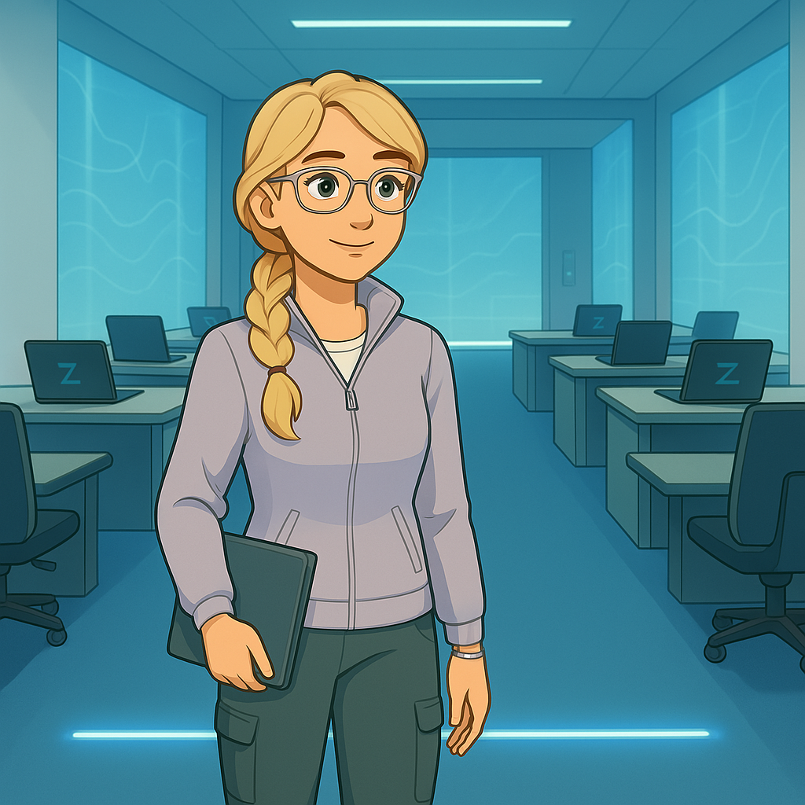
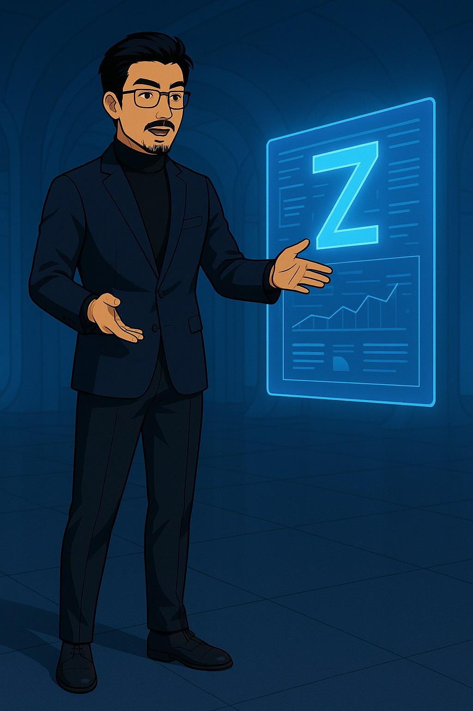
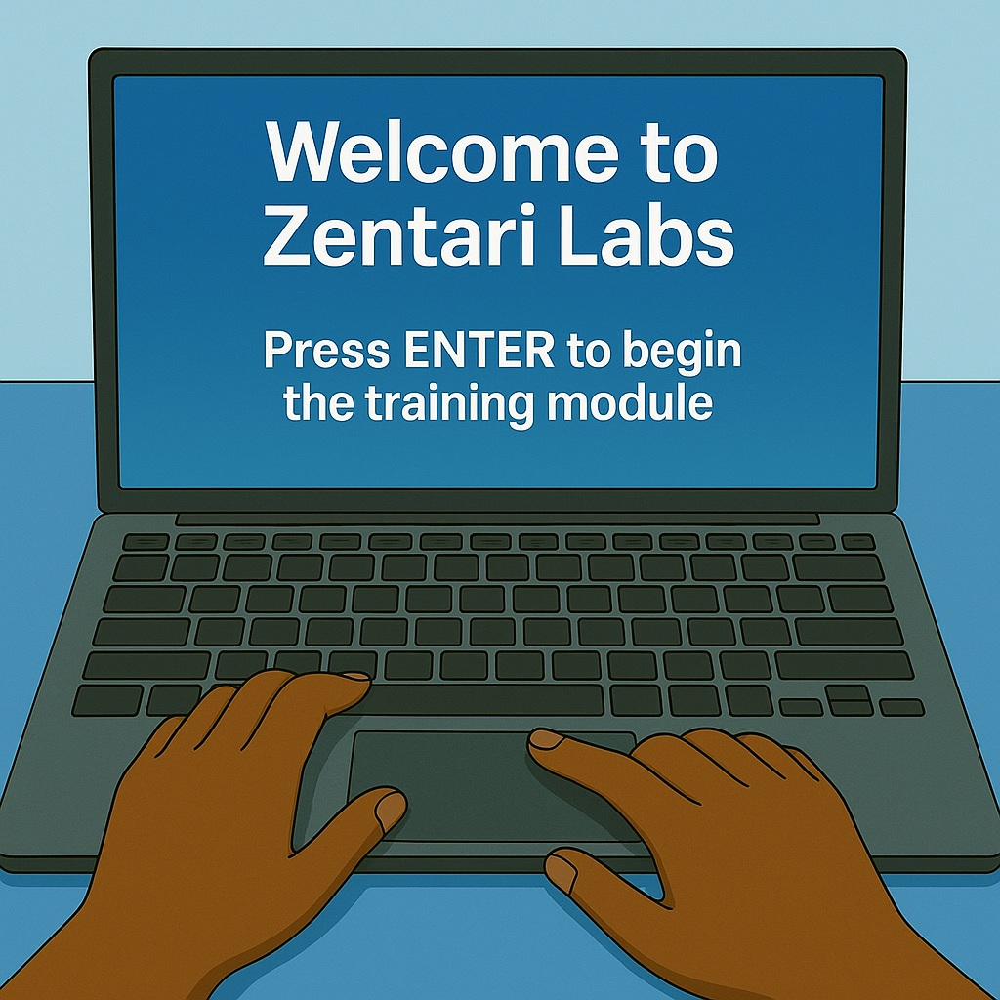

# CASE 000: The Curious Ones

---

## Zentari Labs Lobby, Arrival

Renzo stepped into Zentari Labs for the first time, his eyes widen as he took in the chrome and glass lobby, sunlight pouring through floor to ceiling windows in soft blues and silver tones that felt almost futuristic. Beside him, Inspector Pupps sat alert but calm, golden curls glowing in the morning light like they belonged here.

Renzo wasn’t so sure he did.

The space buzzed with movement and quiet confidence, like everyone else had already passed some unspoken test.

"What if I’m not ready? What if they realize I don’t belong?"

Renzo adjusted the strap on his bookbag, nerves prickling just beneath his skin.
He glanced down at Pupps, who gave a soft, grounding huff, a reminder that he wasn’t alone.

A sharp tap of sneakers on polished tile snapped his attention to the entrance behind him.

Zara had arrived.

Her curls bounced with each stride, blonde highlights catching the light. She moved with quiet precision. She had a rust blazer, jeans, white sneakers, gold earrings, and a tote slung confidently over one shoulder.

She met Renzo’s eyes and offered a small, composed smile.
Not overly warm. But real. Like she saw him.

Renzo blinked, caught off guard.
She looks like she belongs here too.

"Say something", he thought. "Anything. You’re both interns. She probably feels weird too."
But the words stuck somewhere between his nerves and his throat.

Before the silence settled too heavily, the lobby doors opened again.

Dev stepped in, hoodie layered over a t-shirt, jeans, and a bag packed like he was staying the night. His eyes lit up at the sight of the others.

“Yo! You Nova too?” Dev grinned, his energy already filling the space as he offered a fist bump.

Renzo met it a beat late, but it landed.

Dev had the kind of presence that made the lobby feel just a little less intimidating.

Zara offered a small, friendly smile, then glanced at the welcome email on her phone.
“Floor 22,” she said. “That’s where we’re headed.”

After checking in, they headed towards the main elevators. Renzo kept pace beside her, fingers brushing the strap of his backpack. The silence wasn’t unfriendly, just expectant. Like the building was holding its breath. Or maybe… he was.

## Elevator to Floor 22, First Impressions

Zara stepped in first and tapped the number 22. The touchscreen lit up, a glowing blue ring swirling around it as the trio entered and the doors slid shut.

Renzo stood silently, his bag still strapped tightly to his shoulders. Dev swayed slightly, bobbing to a beat in his head. Zara was already scrolling on her phone.

He could feel the difference between them. Dev seemed like the type who made friends in five minutes. Zara looked like she didn’t need anyone at all. Pupps sat between them, calm as ever. His tail brushed Renzo’s ankle in a quiet reassurance.

Dev leaned forward, eyes scanning the glowing panel. "Crazy, right? Out of everyone… why us?" Renzo nodded, but Zara didn’t even look up.

The elevator chimed. Floor 22.

## Cohort Workspace, Enter the Eight

As the doors slid open, a glowing hallway stretched out, white walls, blue floor lights pulsing gently. A single line of text glowed near the floor:

Only the curious get chosen.

Dev stepped out first, grinning. "I like the vibes already."

The room was a spacious training floor with individual desks, each with a Zentari laptop. Renzo counted eight in total. 

"Are there more of us?" he asked quietly.

Zara didn’t turn. "Eight total. We’re just early."

Renzo slid into the seat farthest from the door. Pupps curled up beside his chair without a sound. Zara took the spot two seats down. Dev sat between them. 

Four other interns stepped into the room. Some walked directly to their laptops. Others hovered, scanning the space like they weren’t sure where to sit. No one said much. Then came the last: a tall girl with silver glasses with a low side braid. She gave a polite nod to no one in particular and made her way to a desk at the other far end.

As the final intern stepped into the room, the lights dimmed. A soft chime echoed overhead. Then, with quiet confidence, a sharply dressed man entered behind them. He moved to the center of the room, raised a hand, and the space responded. A glowing “Z” emblem shimmered into view, slowly rotating before unfolding into a full holographic display.

"Welcome to Zentari Labs" he said, voice calm and reassuring. "My name is Hiro and I will be one of the leading mentors in this cohort. You weren’t just chosen for your skills, you were chosen because you’re curious. And in this place, only the curious move forward. You are Cohort 4 of Project Nova. Thousands applied. Only eight were selected"

Dev whispered, "Only the curious get chosen, interesting."

"Project Nova is a fully immersive experience. You’ll receive new cases, and each one reflects a real world challenge you might face in a cloud native environment. But before each case begins, you’ll complete a brief training module. These are delivered directly to your terminal. Complete the module, and then unlock the case."

Zara leaned back slightly, arms crossed.

"Your first tasks begins with how apps have evolved and the need for Kubernetes. You’ll be introduced to the CLI short for command line interface and kubectl, short for Kubernetes Control. There has been debate on how to pronounce it. But if you want to stand out and be right it’s kyoob-see-tee-ell."

Renzo nodded slightly to himself.

"Training modules will teach you what you need to know while the cases will show you if you’ve truly learned it."

The hologram folded down like origami into a single blinking prompt.

"Good luck, Cohort 4. Your journey starts now" he added, already walking toward the exit. He didn’t look back, he didn’t need to. The door slid closed behind him with a soft hiss. The room returned to normal light.

Renzo stared at the screen. Next to him, Dev was already typing. Zara was skimming the training module. Pupps had curled up under the desk again, a small safe zone.

Renzo exhaled. He tapped the trackpad. The screen blinked to life.

*Welcome to Zentari Labs*

*Press ENTER to begin the training module...*

He nervously pressed ENTER.

Pupps sat close, his quiet presence grounding. Between him and the two he'd just met… maybe, just maybe, everything would turn out alright.

---

## Nova Knowledge Check  
*Pre-Case Readiness Verification*  
To proceed with **Training Module 001**, all interns must confirm foundational knowledge from the overview.

---



---

To continue your journey:

👉 [**Enter Training Module 001 – The Evolution of the App**](../training-modules/tm-001.md)
