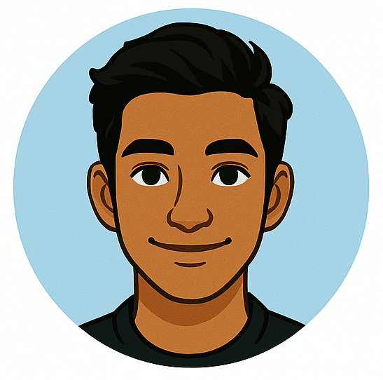

# Character Profile: Dev

**Role:** Intern – Automation & Internal Tools Track  
**Affiliation:** Zentari Labs, Project Nova (Cohort 4)  
**Age:** 21  
**University:** Coastal Systems Institute (CSI)  
**Specialty:** Tooling, Automation, and Developer Experience

---

### Overview
Dev is the spark of the intern trio. He is creative, optimistic, and always building something. Known for his enthusiasm and quick wit, he brings a layer of fun and humanity to technical problem-solving.

---

### Personality Traits
- **Energetic & Inventive** – If there's a way to automate it, Dev's already halfway through building it.  
- **Social Glue** – He’s the kind of teammate who can get anyone talking, even on the most stressful days.  
- **User-Obsessed** – Every tool Dev makes is designed with people in mind: accessible, intuitive, and helpful.

---

### Background
Dev comes from the cross-disciplinary engineering program at CSI, where he gained a reputation for building clever tools that actually get used. He was recruited into Project Nova after one of his open-source CLI projects gained traction in the cloud-native community.

---

### What to Expect
Don’t let his jokes fool you. Dev takes engineering seriously, especially when it comes to simplifying workflows and improving systems. Throughout the series, his blend of creativity and compassion will surprise even his closest teammates.
