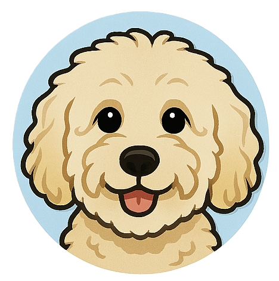

# Character Profile: Inspector Pupps

**Role:** Service Dog, Emotional Support Companion  
**Affiliation:** Zentari Labs, unofficial mascot of Project Nova  
**Specialty:** Calming nerves, noticing details, sniffing out misconfigurations

---

### Overview
Inspector Pupps is more than just a service dog. He’s Renzo’s loyal companion and an unspoken member of the intern trio. With a curious nose for technical trouble and a surprisingly expressive face, Pupps is always nearby when a mystery strikes.

---

### Personality Traits
- **Loyal & Protective** – Always close to Renzo’s side, especially during stressful moments.  
- **Emotionally Intelligent** – He can sense tension in the room long before anyone speaks.  
- **Inquisitive** – From blinking terminals to blinking humans, nothing escapes Pupps’ attention.

---

### Background
Approved by Zentari Labs’ service animal policy, Pupps was trained to support Renzo through periods of high stress and focus fatigue. Quietly, he’s become a fixture in the Project Nova workspace, often seen curled at a desk, peeking into Slack huddles, or staring down the blinking light of a failing pod.

---

### What to Expect
Pupps doesn’t talk, but if he could, he’d probably ask, *“Did you check the logs?”*  
Keep an eye on where he looks. Sometimes, he finds clues before the team even knows there’s a case to solve.
