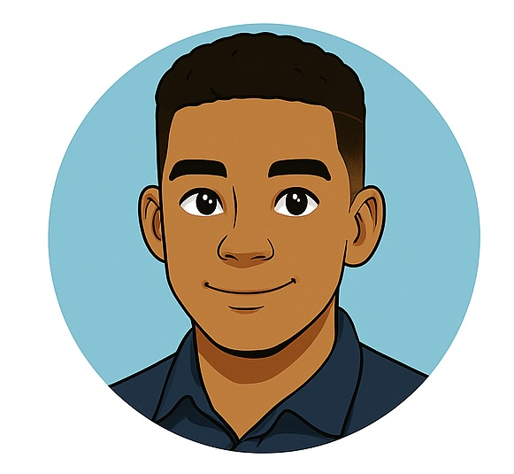

# Character Profile: Renzo

**Role:** Intern – Cloud Engineering Track  
**Affiliation:** Zentari Labs, Project Nova (Cohort 4)  
**Age:** 21  
**University:** Solara Polytechnic University (SPU)  
**Specialty:** Kubernetes Troubleshooting & Observability

---

### Overview
Renzo is a curious, quiet, and thoughtful intern with a natural eye for patterns and a growing passion for cloud systems. Selected for Project Nova, Zentari Labs’ elite internship program, Renzo is determined to make the most of this rare opportunity to grow as an engineer.

---

### Personality Traits
- **Observant** – Renzo notices the details others miss.  
- **Calm Under Pressure** – Years of hands-on lab simulations at SPU have prepared him for real-world technical challenges.  
- **Introverted but Curious** – He’s not the loudest in the room, but his questions cut straight to the core of a problem.

---

### Background
Renzo is a senior student at Solara Polytechnic University, a highly regarded school for systems engineering and distributed computing. His natural focus and humility earned him a spot in Project Nova, where he now works alongside other promising interns at Zentari Labs.

---

### Companion
Renzo is often seen accompanied by **Inspector Pupps**, his loyal service dog. Pupps provides focus and calm in high-pressure moments and has a personality all his own.

---

### What to Expect
As the story unfolds, Renzo’s technical instincts and determination will be tested across a series of mysterious Kubernetes scenarios. He might not always have the answer right away, but he never stops investigating.

