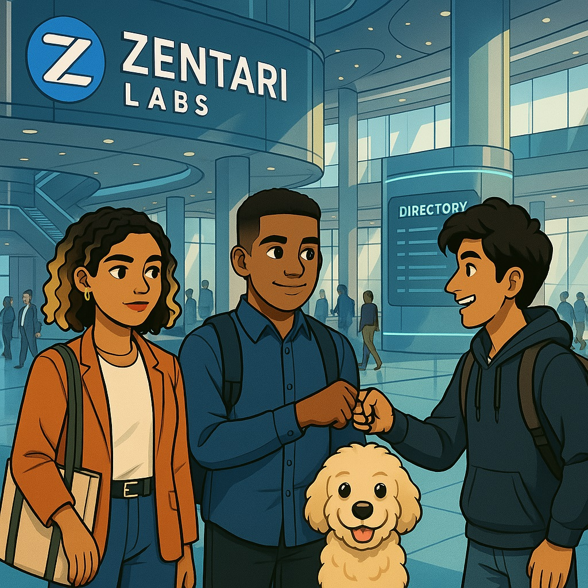

# Welcome to Pods and Clues
*Only the curious get chosen.*

You're about to enter a different kind of cloud internship, one where YAML files hold secrets, and every `kubectl` command might uncover more than just pods.

At the heart of Zentari Labs, eight interns were selected from thousands of applicants to join **Project Nova**, a high-stakes program designed to shape the future of cloud infrastructure. But not everything is as it seems...

Follow Renzo, Zara, and Dev, three curious interns, as they step into a sleek, intimidating lobby for the first time. Among them is **Inspector Pupps**, Renzo’s emotionally intuitive golden doodle support dog who never leaves his side. Together, they're about to be tested in ways they never expected.

Through each case, you'll:

* Learn real Kubernetes skills
* Solve immersive mysteries
* Uncover the hidden truth behind Project Nova

---

## 📦 What Is *Pods and Clues*?

*Pods & Clues* is an interactive learning story that blends:

* 📘 Kubernetes Certification (CKAD) content
* 🧩 Visual storytelling and comics
* 🧠 Technical mysteries and terminal-based training
* 🐶 And yes — a loyal dog with a nose for debugging

Whether you're switching careers, learning Kubernetes for the first time, or just love a good story, you're in the right place.

---

## 🕵️ Start the Story

To begin your journey:

👉 [**Enter Case 000 – The Curious Ones**](cases/case-000.md)

*Because in Kubernetes and in life, curiosity always comes first.*
