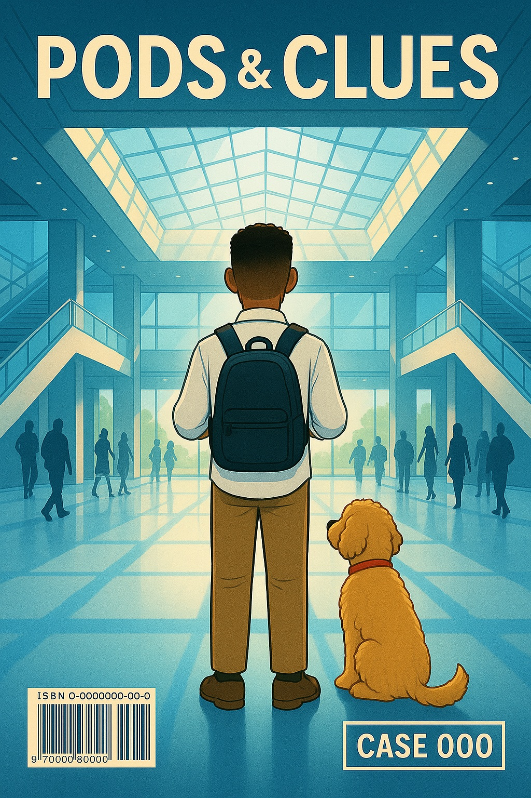

# 🧩 What Is *Pods & Clues*?

*Pods & Clues™* is a Kubernetes Mystery Series where every misconfigured pod is a clue… and the debugger is your magnifying glass.

🧠 Think like an engineer  
🔍 Act like a detective  
💬 Learn through story  
✨ And totally unlike anything else 

## 🚀 Learn Kubernetes by Solving a Mystery

Through immersive cases, you’ll:

🧠 Learn real Kubernetes certification topics (CKAD, CKA, CKS)  
📚 Connect emotionally to characters with relatable growth arcs  
🐾 Follow the clues with help from Inspector Pupps, the debugging goldendoodle with better instincts than most humans

## 🎭 The Setup

> Only the curious get chosen

You’ll follow [Renzo](characters/renzo.md), [Zara](characters/zara.md), [Dev](characters/dev.md), and [Inspector Pupps](characters/pupps.md), the goldendoodle who never leaves Renzo’s side. These three interns have been choosen for a top secret cloud training program at Zentari Labs, a place built on innovation, and hiding something just out of sight.

The lobby is alive with movement, voices echoing through glass and steel. But in Renzo’s head, everything goes quiet.
It feels like stepping into a story already in motion. One he’s somehow supposed to finish.

Eight interns made it through.
But one of them is hiding something.

And in a place built to reveal your potential, what happens when someone learns how to hide?

---

## 🕵️ Ready to Begin?

> This is your first step into Zentari Labs.  
> Check in. Grab your ID badge. Watch the elevator rise up to Floor 22.  
> Because in Kubernetes and in life, curiosity always comes first.

👉 [**Enter Case 000 – The Curious Ones**](cases/case-000.md)