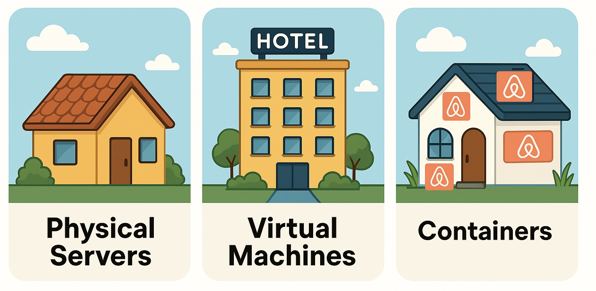
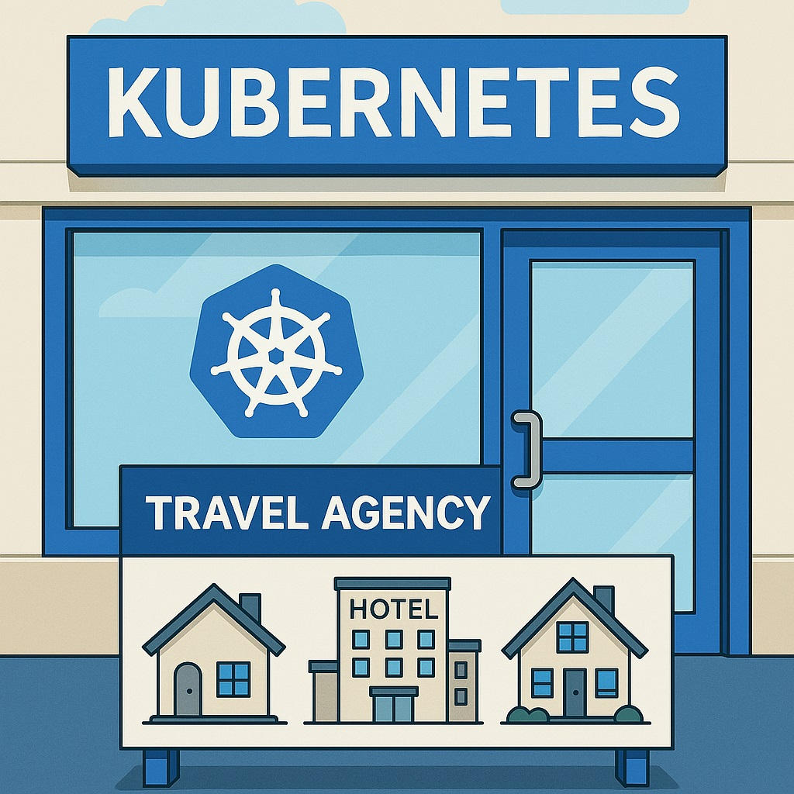

# TM-001: What is Kubernetes & Namespaces
---

**Welcome to Zentari Labs, Cohort 4.**

Before you deploy your first container, we need to ensure you understand the foundation. Kubernetes isn’t just a buzzword, it’s the travel agency for the modern cloud, and to navigate it effectively, you’ll need to know not just how it works, but how *we* use it here at Zentari.

This module will cover:

- How we got here: from physical servers to containers  
- What Kubernetes is and why it exists  
- What namespaces are and how they affect visibility, structure, and security  
- What can go wrong if you ignore them (and how to avoid it)

---

## Part 1: The Journey to Kubernetes

> “Imagine you're planning a trip.”

- **Physical servers were like owning a house**  
  You had to buy a physical server, set it up, and maintain it. One app per server, expensive and inflexible.

- **Virtual machines were like renting hotel rooms**  
  You could share the same building (server) with multiple guests (apps), each isolated in their own room. Better, but still bulky and centralized.

- **Containers are like Airbnbs**  
  Lightweight. Portable. Self-contained. Each container includes your app *and* everything it needs to run. You can spin them up anywhere, anytime. 



!!! note
    In Kubernetes terms, an app is typically wrapped in something called a pod. A pod is the smallest deployable unit. It's a logical wrapper around your containerized app. From this point forward, we'll refer to your app as a pod.

But… as with any successful system, scale becomes the challenge. What happens when you need to manage **hundreds or thousands** of containers?

---

## Part 2: Enter Kubernetes

**Kubernetes is your travel agency.**



It schedules, launches, monitors, restarts, and kills containers across a fleet of servers. It handles the logistics so you can focus on your app.

You don’t have to worry about where exactly your container is running, Kubernetes handles that. Your job is to describe *what* you want, and Kubernetes figures out *how* to make it happen.

At Zentari, we run Kubernetes clusters across multiple environments. Every application, service, and tool is a traveler in this system, and you’re about to deploy your first one.

---

## Part 3: Namespaces – The Organizational Layer

Now imagine eight interns deploying apps with similar names and structures at the same time. What could go wrong?

**Namespaces prevent chaos.**

They are Kubernetes' way of **dividing a cluster into multiple virtual spaces**. Each namespace is isolated but still able to share the physical infrastructure.


### Why we use namespaces
- **Organization**: Teams, environments, or interns can work in separate spaces.
- **Safety**: Mistakes in one namespace won’t affect others.
- **Clarity**: It’s easier to monitor, troubleshoot, and manage workloads when they’re grouped logically.

At Zentari Labs, your cohort operates in the namespace:

```bash
nova-cohort-4
```

That’s your space. Everything you create should live there.

## Part 4: The Classic Mistake

You deploy a pod…
You run `kubectl get pods`…
And you see nothing.

Did something fail? Is the cluster broken?
Nope. You just looked in the wrong namespace.

By default, kubectl only looks at the *default* namespace. If you don’t specify where to look, Kubernetes assumes that’s where you’re working.

## Part 5: How to Work the Right Way
Option 1: Use the CLI flag when querying

`kubectl get pods --namespace=nova-cohort-4`

or

``kubectl get pods -n=nova-cohort-4``

Option 2: List all pods across all namespaces (not recommended long-term)

`kubectl get pods --all-namespaces`

or

`kubectl get pods -A`


## Nova Knowledge Check  
*Pre-Case Readiness Verification*  

Before you move on, make sure you’ve absorbed the essentials.  
Answer the following questions based on what you just read:

---

**1. Why do modern teams use Kubernetes?** 
A. To host websites without needing the internet  
B. To make YAML files more colorful  
C. To build mobile apps  
D. To launch and manage containers across many machines automatically  
<details><summary>Answer</summary><strong>D — To launch and manage containers across many machines automatically</strong></details>

---

**2. What happens if you don’t specify a namespace in your `kubectl` command?**  
A. Kubernetes creates a new namespace automatically  
B. The command will fail  
C. Kubernetes uses the `default` namespace  
D. It prompts you to choose one  
<details><summary>Answer</summary><strong>C — Kubernetes uses the `default` namespace</strong></details>

---

**3. What’s a good reason to use namespaces in a Kubernetes cluster?**  
A. To organize resources into separate environments  
B. To install apps from the internet  
C. To make pods restart faster  
D. To create more CPU for your containers  
<details><summary>Answer</summary><strong>A — To organize resources into separate environments</strong></details>
---

**4. Which of these commands will show all pods across all namespaces?**  
A. `kubectl get all`  
B. `kubectl pods`  
C. `kubectl get namespaces`  
D. `kubectl get pods -A`  
<details><summary>Answer</summary><strong>D — `kubectl get pods -A`</strong></details>
---

**5. What is the namespace used by Zentari Labs for your cohort?**  
→ Answer: `___________`  
<details><summary>Answer</summary><strong>Correct answer: `nova-cohort-4`</strong></details>

---

To continue your journey:

👉 [**Enter CASE 001 – The Case of the Missing Pod**](../cases/case-001.md)