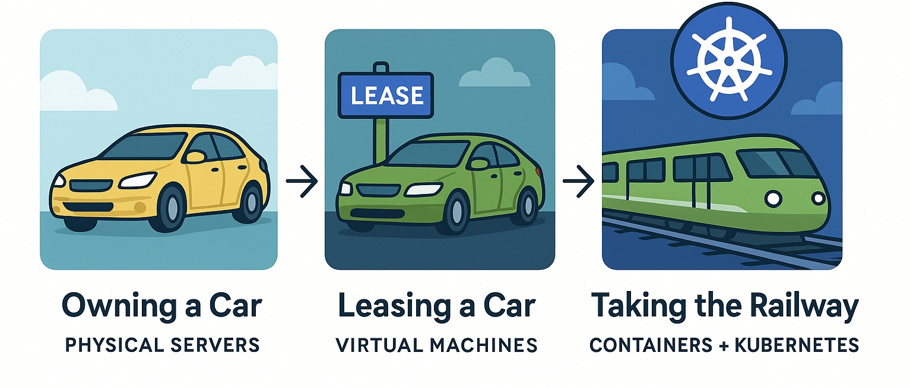
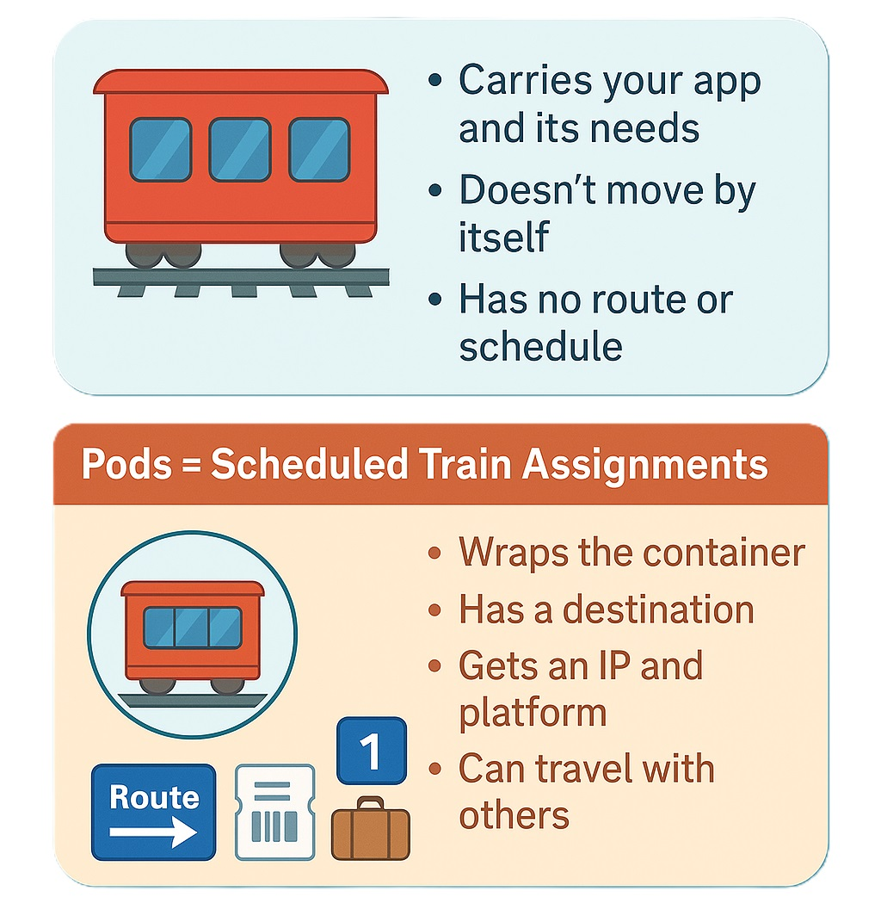
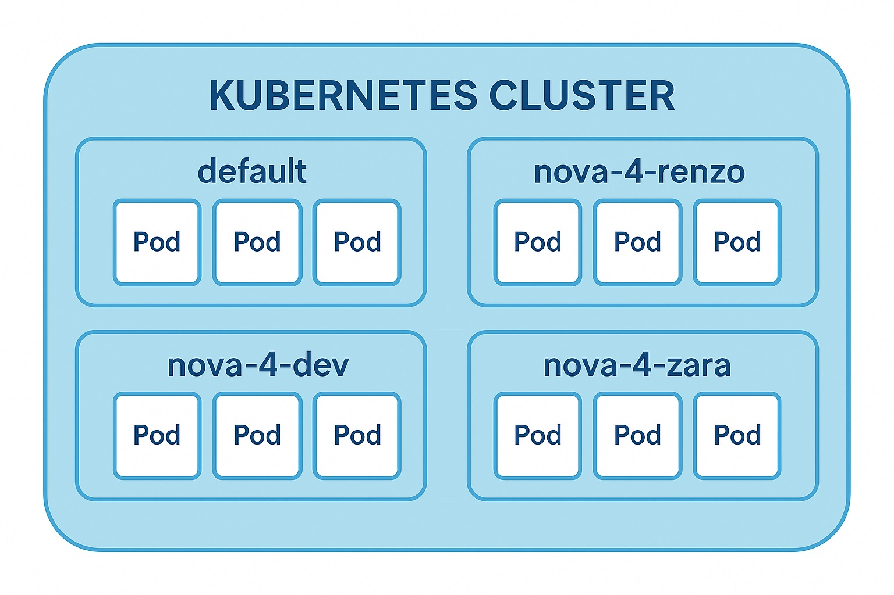

# TM-001: What is Kubernetes & Namespaces
---

**Welcome to Zentari Labs, Cohort 4.**

Before you deploy your first container, we need to ensure you understand the foundation. Kubernetes isn’t just a buzzword, it’s the orchestrator for the modern cloud, and to navigate it effectively, you’ll need to know not just how it works, but how *we* use it here at Zentari.

This module will cover:

- How we got here: from physical servers to containers  
- What Kubernetes is and why it exists  
- What namespaces are and how they affect visibility, structure, and security  
- What can go wrong if you ignore them (and how to avoid it)

---

## Part 1: The Journey to Kubernetes

## The Travel Analogy: From Ownership to Orchestration

> Let’s say you need to get to different cities regularly.  
> Here’s how your transportation, and application hosting has evolved.

---

### **Stage 1: Owning a Car *(Physical Servers)***

You buy your own car.  
You're responsible for the cost, maintenance, fuel, repairs, and parking.  
It’s always available, but expensive and often underused.

**This is how we used to run applications:**  
One server per app. You owned, and managed it 24/7, even if it wasn’t doing much.

---

### **Stage 2: Leasing a Car *(Virtual Machines)***

You stop owning and start **leasing** a car when you need it.  
You still drive it yourself, but the long term upkeep isn’t your concern.  
It’s more flexible, and the same provider can lease multiple cars to different people.

**This is like virtual machines:**  
Shared physical resources, isolated environments.

---

### **Stage 3: Taking the Railway *(Containers + Kubernetes)***

Now you use the **railway system**.  
No ownership, no leases. You just show up, tap your card, and ride.  
The train is ready, and everything you need is built in.  
You don’t worry about infrastructure, just where you’re going.

**That’s what containers bring:**  
Lightweight, portable environments that move easily across systems.

---

### **But trains alone aren’t enough…**

Imagine thousands of people moving between cities every hour.

- Who manages the schedules?
- Who reroutes trains when tracks fail?
- Who prevents overcrowding?

---

> **That’s what Kubernetes does.**  
> It’s the **rail traffic controller** — orchestrating thousands of apps (trains) across a system, automatically.




!!! note "What's the Difference Between a Pod and a Container?"

Let's revisit our railway analogy to understand the difference between **containers** and **pods**.

### 🚆 Containers = Train Cars  
Containers are like individual **train cars**.  
Each one carries passengers (your app) and has everything it needs onboard such as seats, lights, AC, power.

But:

- A train car alone doesn't move
- It doesn't know where to go
- It needs to be assigned to a route and managed

---

### 🎫 Pods = Scheduled Train Assignments  
A **pod** is like the **logical train assignment** that Kubernetes manages.  
It wraps the container in everything it needs to run in the system:

- A destination (which node)
- A ticket (IP address and identity)
- A platform assignment (scheduling info)
- Luggage (volume mounts)
- Instructions on how to travel with others (networking, probes)

---

Kubernetes never runs a container directly, it always wraps it in a **pod**.  
Even if it's a single container, the pod gives it context inside the cluster.

> _"Here’s your train car... but now it’s on the schedule, with a route, a conductor, and a place to be."_

---

### ✅ Summary



But… as with any successful system, scale becomes the challenge. What happens when you need to manage **hundreds or thousands** of containers?

---

## 🚦 Part 2: What Is Kubernetes?

If containers are like train cars, and pods are the official train assignments, then **Kubernetes** is the entire **railway system that keeps everything running**.

---

### 🧠 Kubernetes is the Conductor, Scheduler, and Traffic Controller

You’re not just sending one train from A to B.

You’re managing **hundreds of train cars**, across **dozens of destinations**, with:

- Delays
- Track failures
- Schedule changes
- Passenger needs (your apps)

This kind of complexity can’t be managed manually.  

You need a system that can:

- 🚂 Schedule trains (pods) on the right tracks (nodes)
- 🔁 Restart them if they fail
- 🛠️ Keep them healthy with regular checkups
- 📍 Route traffic to the right destination
- 🧱 Scale up when demand increases and back down when it drops

---

### ✅ That's Kubernetes.

> Kubernetes is your **rail traffic system**.  
> It makes sure every pod (train assignment) is on track, running smoothly, and serving the right purpose. All without you having to manage each one directly.

---

## Part 3: Namespaces

Now imagine eight interns deploying apps with similar names and structures at the same time. What could go wrong?

**Namespaces prevent chaos.**

They are Kubernetes' way of **dividing a cluster into multiple virtual spaces**. Each namespace is isolated but still able to share the physical infrastructure. In the following image, you can see a Kubernetes cluster that has been divided into 4 namespaces, and the pods within each namespace is isolated from each other.



### Why we use namespaces
- **Organization**: Teams, environments, or interns can work in separate spaces.
- **Safety**: Mistakes in one namespace won’t affect others.
- **Clarity**: It’s easier to monitor, troubleshoot, and manage workloads when they’re grouped logically.

At Zentari Labs, each intern will have their own namespace using the following format where you replace `NAME` with your name:

```bash
nova-4-NAME
```

That’s your space. Everything you create should live there.

## Part 4: The Classic Mistake

You deploy a pod…
You run `kubectl get pods`…
And you see nothing.

Did something fail? Is the cluster broken?
Nope. You just looked in the wrong namespace.

By default, kubectl only looks at the *default* namespace. If you don’t specify where to look, Kubernetes assumes that’s where you’re working.

## Part 5: How to find the pods
Option 1: Use the CLI flag when querying a *specific* namespace

`kubectl get pods --namespace=nova-4-renzo`

or

`kubectl get pods -n=nova-4-renzo`

Option 2: List all pods across all namespaces (not recommended long-term)

`kubectl get pods --all-namespaces`

or

`kubectl get pods -A`


## Nova Knowledge Check  
*Pre-Case Readiness Verification*  

Before you move on, make sure you’ve absorbed the essentials.  
Answer the following questions based on what you just read:

---



---

To continue your journey:

👉 [**Enter CASE 001 – The Case of the Missing Pod**](../cases/case-001.md)