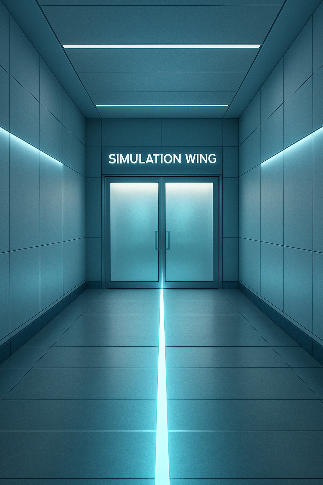

# CASE 001: The Scale Factor

---

## Cohort Workspace | System Notice

Renzo reread the final line of the training module glowing on his laptop screen.

> *But… as with any successful system, scale becomes the challenge. What happens when you need to manage hundreds or thousands of containers?*

He leaned back slightly, letting the thought settle in.

Beside him, Inspector Pupps shifted, resting his chin on Renzo’s foot. The soft weight was familiar, a quiet anchor in the hum of the workspace.

A soft chime echoed from his terminal.

> **ZENTARI SYSTEM NOTICE**  
> Cohort 4: Proceed to Simulation Wing located in Sublevel 3  
> Challenge environment is now active.

Renzo blinked. "*Simulation Wing?*"

Before he could react, Dev spun around in his chair so fast it squeaked.

“Simulation wing?” he said, already halfway up. “We’re seriously doing the cool stuff this early?”

Renzo flicked his wrist and locked his laptop in one smooth motion. His eyes darted toward Dev’s screen, still glowing next to him.

Inspector Pupps let out a low *huff*, like he was unimpressed by the chaos.

Zara stood without a word. Her movements were calm and exact. She slid her laptop into her tote bag in one clean motion.

“You always pack up like someone’s gonna steal your secrets,” Dev said with a grin.

Zara gave him a glance. “Because sometimes… they do.”

She was already walking toward the elevator.

Dev gave Renzo a look that said, *Is she serious?*, but Renzo just shrugged his shoulders. Pupps rose too, alert now, ears forward.

They followed Zara out of the workspace, the quiet sound of their footsteps fading down the hall.

## Elevator to Sublevel 3 | En Route to Simulation Wing

The elevator doors slid open.

Dev stepped in first.

“Sublevel 3?” he said, tapping the panel. “They don’t send interns this deep unless something’s about to be awesome… or explode.”

Zara walked in without a word. Her posture was perfect, eyes fixed forward.

Renzo followed with Pupps close beside him, the goldendoodle’s reflection flickering in the elevator walls.

The doors closed behind them, and the elevator began its silent descent.

Dev leaned casually against the rail.

“So… how classified do you think this is?”

“Whatever it is,” Zara said, “it’s not going to be something they’ll explain twice.”

Pupps gave a soft tail wag at the sound of her voice, then settled into quiet focus.

The elevator slowed. A chime echoed as the panel above the doors lit up:

> **SUBLEVEL 3**

The doors opened to a hallway of silver panels. A thin line of white light pulsed under their feet, forming a path that moved forward as they did.

Renzo stepped out last, watching the way the light reacted to their steps, not just guiding them, but tracking them. Zentari didn’t build anything for aesthetics. It built everything to observe.

At the end of the hall stood a pair of tall, frosted-glass doors, softly lit from above.

“Alright, Simulation Wing. Let’s see what you’ve got.”

Pupps lowered his head slightly, eyes forward, as if bracing for whatever came next.

Renzo said nothing. His eyes stayed on the doors as they slid open without a sound.

## Simulation Chamber, Sublevel 3 | Entry Briefing

The doors opened into a spacious, circular room.

Lights traced the curve of the walls in clean, subtle lines. In the center stood a sleek control console wrapped around a tall, transparent column filled with a soft swirl of shifting data. The whole setup felt more like an exhibit than a workspace. It was elegant, precise, and meant to impress.

Renzo stepped inside, scanning the layout. It wasn’t a lab. It wasn’t even a test chamber. It felt like a stage.

Dev gave a quiet whistle and stepped forward. “Okay… this is way cooler than I thought it’d be.”

Pupps stayed at Renzo’s side, watching with quiet attention. The goldendoodle sat calmly but alert, eyes following the moving lights on the column.

Zara moved toward the console without a word, eyes already reading the display even before it fully powered on.

A nearby door opened with a smooth whisper. Hiro entered with a tablet in hand, his footsteps soft against the polished floor. He nodded to the group as he approached the console.

“Welcome to the Simulation Wing,” he said. “Today, no commands. Just observations.”

He tapped the interface. The central column brightened, and the console came alive. On the curved display, the NovaMail application launched, a clean email client UI accompanied by system dashboards and scrolling metrics.

“This app is running in three different environments. Same code. Different foundations. Watch what happens when they get loaded with thousands of customers, then decide which one you'd trust.”

He looked at each of them briefly, then stepped aside, just far enough to watch without interrupting.

Before anyone could speak, the door behind them opened again.

A girl entered, the tall girl with silver glasses with a low side braid. She gave a polite nod.

“Sorry I’m late,” she said. “Bathroom.”

Dev turned and grinned. “You made it just in time to crash a few simulated systems. They built ‘em just for us to break.”

She smiled slightly as she walked over to the group. “Perfect. I wouldn’t want to miss that.”

She took her place near the console. The group shifted forward instinctively, drawn to the glow of the dashboard as the lights above the room dimmed.

The simulation was about to begin.

## Simulation Chamber, Sublevel 3 | Load Challenge

A soft countdown appeared on the main display.

**System Challenge Initiating in 10… 9… 8…**

The dashboard split into three panels:

- **Environment A - Physical Server**  
- **Environment B - Virtual Machine**  
- **Environment C - Containerized App**

At first, everything looked stable. NovaMail ran cleanly across all three setups. CPU usage was low. Memory held steady. User sessions ticked upward in a calm stream.

Dev leaned in slightly. “Okay… this is totally gonna explode.”

“It’s a stress test,” Zara said, arms crossed. “Nothing’s supposed to explode. It’s supposed to expose.”

Renzo didn’t respond. His eyes were fixed on Environment B. Something about the delay in its response times felt off. Barely noticeable. But enough to register.

The countdown hit zero.

Suddenly, all three environments were hit with a simulated wave of thousands of users at once.

---

**Environment A - Physical Server**

CPU spiked to 95% almost instantly.  
!!! note "CPU = Central Processing Unit, is the part of the system that does the thinking. High usage means it’s working near its max."

Pages slowed. Logs showed I/O bottlenecks.
!!! note "I/O = input/output. Delays between the app and the disk, like the data was stuck in traffic with nowhere to go."

**Status: Running – Degraded**

Dev tilted his head. “This is like trying to serve pizza to a stadium... with only one oven.”

---

**Environment B - Virtual Machine**

CPU climbed to 70%, then plateaued.  
A second VM tried to start, but booted slowly.  
Users got stuck on loading screens. After nearly a minute, the system began to catch up.

**Status: Recovering – Scaling in Progress**

Zara gave a short nod. “At least it’s trying.”

---

**Environment C - Containerized App**

The system detected the spike almost immediately.  
Replica count jumped from 1 to 6 in seconds.  
CPU and memory stayed balanced. Sessions ran smoothly.

**Status: Healthy – Autoscaling Active**

Renzo leaned in. “It didn’t even blink.”

---

As the load stabilized, the dashboard returned to normal. 

A new message appeared at the top of the console:

> **CHALLENGE COMPLETE**  
> Based on your observations, please answer the following questions as a cohort.  
> Your choices will be recorded.

## Simulation Chamber, Sublevel 3 | Quiz Checkpoint



## Simulation Chamber, Post Quiz Debrief  

The quiz interface faded. The console dimmed. The center column shifted smoothly, reforming into a soft, rotating holographic globe swirling with gentle blue light.

Hiro stepped forward from where he’d been sitting quietly near the edge of the room.

“Well done,” he said. “You didn’t just watch. You noticed.”

Dev tilted his head. “So… are we going to be working with all three of those setups?”

Hiro shook his head. “You’ll be building in containers. But every modern issue has echoes of the past.”

He looked toward the center of the room.

“You’re not here to memorize syntax. You’re here to learn how systems behave and why they break.”

Zara crossed her arms. “That explains why this felt more like a philosophy class than a lab.”

Hiro gave a small smile. “Good. Containers don’t just run code. They carry assumptions.”

He glanced at the clock display near the exit. "That’s enough for this round. Go recharge. You’ll need your focus for what’s next.”

Dev smirked. “Lunch with side quests. Got it.”

The group turned toward the door.

Then it happened.

A flash of purple flickered across the center column.  
Sharp. Unnatural.  
Gone in less than a second.

Renzo saw it.  
Pupps did too.

He stopped walking.

It hadn’t been part of the sim.  
It hadn’t been there before.

Just a glitch?

Maybe.

Renzo looked back at the now calm holographic globe.

Blue light.  
Silent room.  
No trace.

But he knew what he saw.

And something told him…

It wasn’t a mistake.

---

To continue your journey:

👉 [**Enter Training Module 002 – Kubernetes and Namespaces**](../training-modules/tm-002.md)

