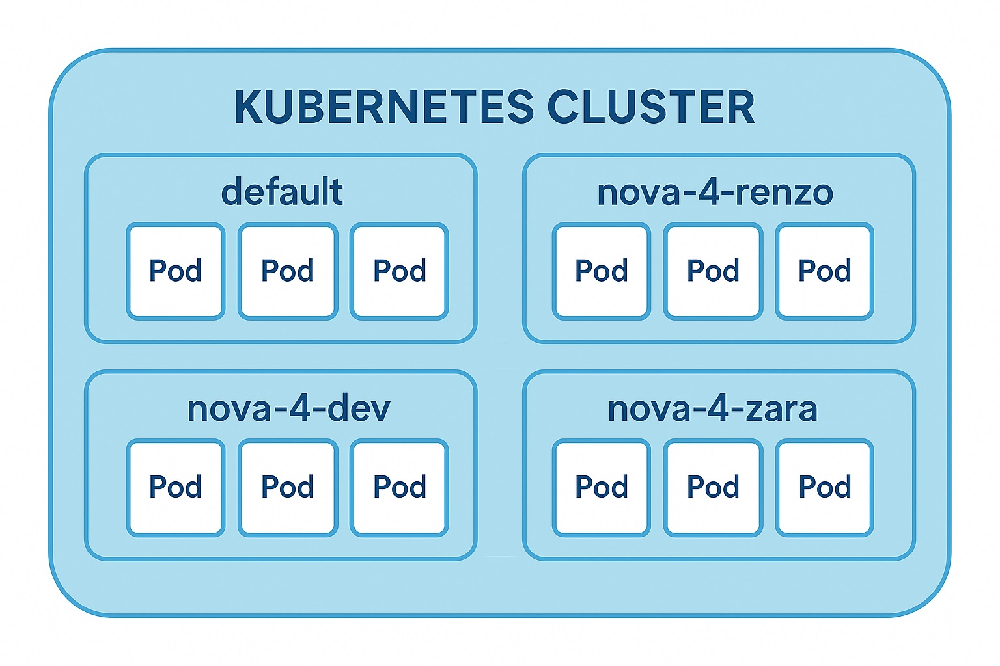

- What Kubernetes is and why it exists  
- What namespaces are and how they affect visibility, structure, and security  
- What can go wrong if you ignore them (and how to avoid it)

---

## 🚦 Part 2: What Is Kubernetes?

If containers are like train cars, and pods are the official train assignments, then **Kubernetes** is the entire **railway system that keeps everything running**.

---

### 🧠 Kubernetes is the Conductor, Scheduler, and Traffic Controller

You’re not just sending one train from A to B.

You’re managing **hundreds of train cars**, across **dozens of destinations**, with:

- Delays
- Track failures
- Schedule changes
- Passenger needs (your apps)

This kind of complexity can’t be managed manually.  

You need a system that can:

- 🚂 Schedule trains (pods) on the right tracks (nodes)
- 🔁 Restart them if they fail
- 🛠️ Keep them healthy with regular checkups
- 📍 Route traffic to the right destination
- 🧱 Scale up when demand increases and back down when it drops

---

### ✅ That's Kubernetes.

> Kubernetes is your **rail traffic system**.  
> It makes sure every pod (train assignment) is on track, running smoothly, and serving the right purpose. All without you having to manage each one directly.

---

## Part 3: Namespaces

Now imagine eight interns deploying apps with similar names and structures at the same time. What could go wrong?

**Namespaces prevent chaos.**

They are Kubernetes' way of **dividing a cluster into multiple virtual spaces**. Each namespace is isolated but still able to share the physical infrastructure. In the following image, you can see a Kubernetes cluster that has been divided into 4 namespaces, and the pods within each namespace is isolated from each other.



### Why we use namespaces
- **Organization**: Teams, environments, or interns can work in separate spaces.
- **Safety**: Mistakes in one namespace won’t affect others.
- **Clarity**: It’s easier to monitor, troubleshoot, and manage workloads when they’re grouped logically.

At Zentari Labs, each intern will have their own namespace using the following format where you replace `NAME` with your name:

```bash
nova-4-NAME
```

That’s your space. Everything you create should live there.

## Part 4: The Classic Mistake

You deploy a pod…
You run `kubectl get pods`…
And you see nothing.

Did something fail? Is the cluster broken?
Nope. You just looked in the wrong namespace.

By default, kubectl only looks at the *default* namespace. If you don’t specify where to look, Kubernetes assumes that’s where you’re working.

## Part 5: How to find the pods
Option 1: Use the CLI flag when querying a *specific* namespace

`kubectl get pods --namespace=nova-4-renzo`

or

`kubectl get pods -n=nova-4-renzo`

Option 2: List all pods across all namespaces (not recommended long-term)

`kubectl get pods --all-namespaces`

or

`kubectl get pods -A`